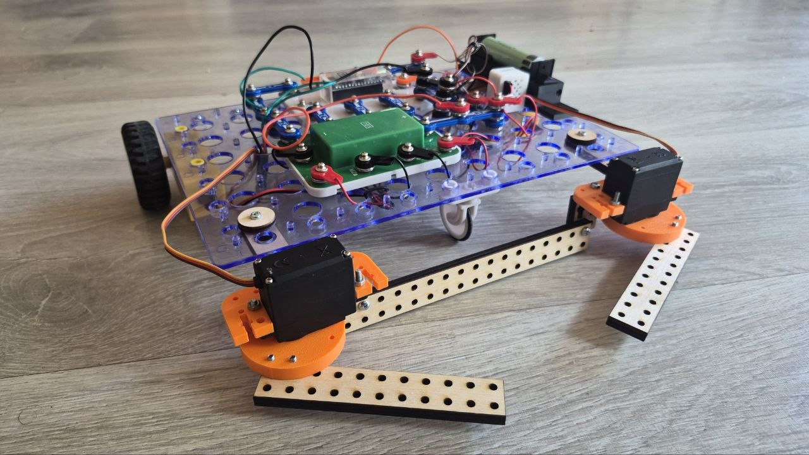
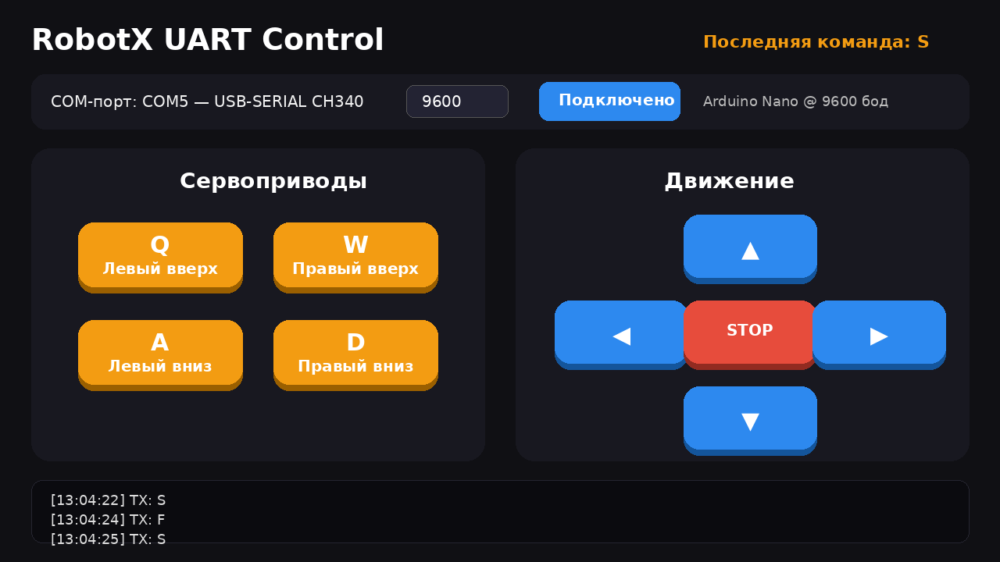
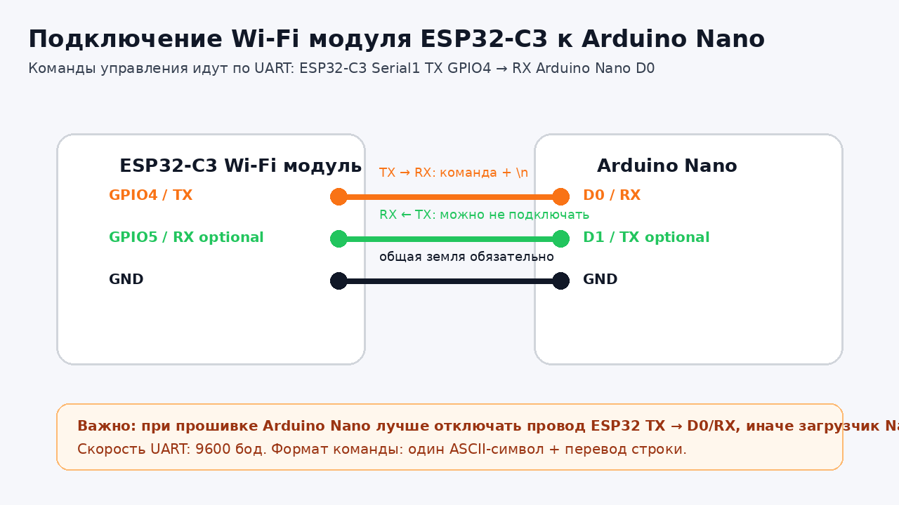
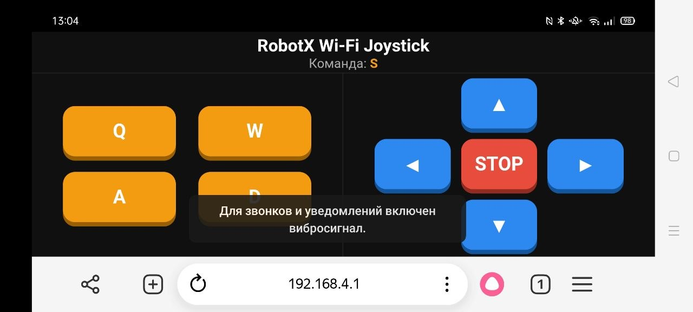
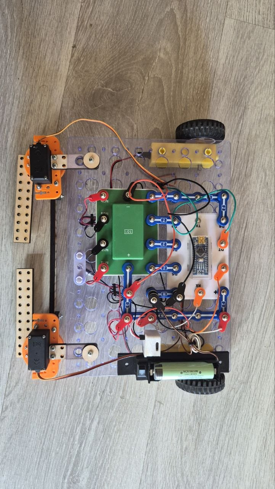
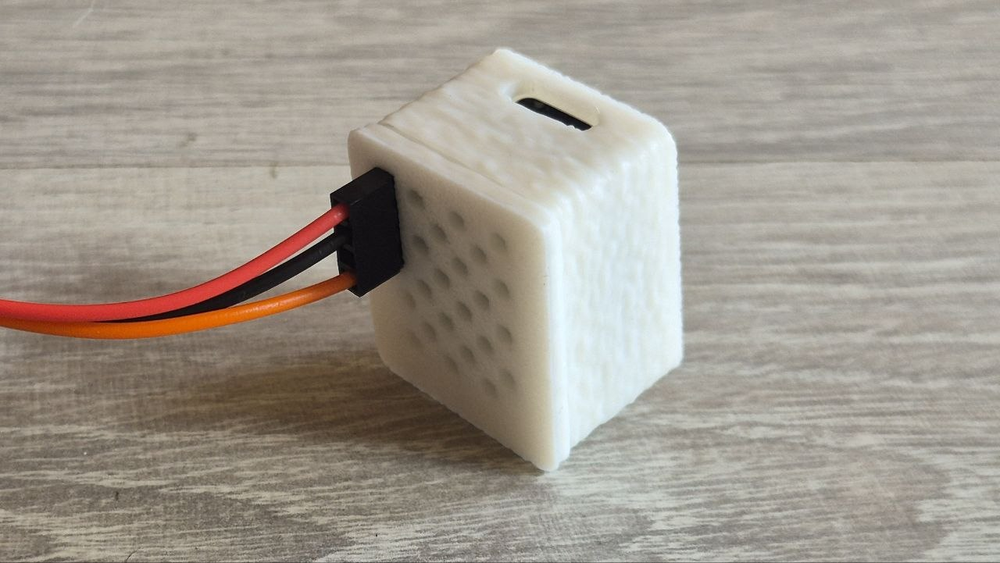
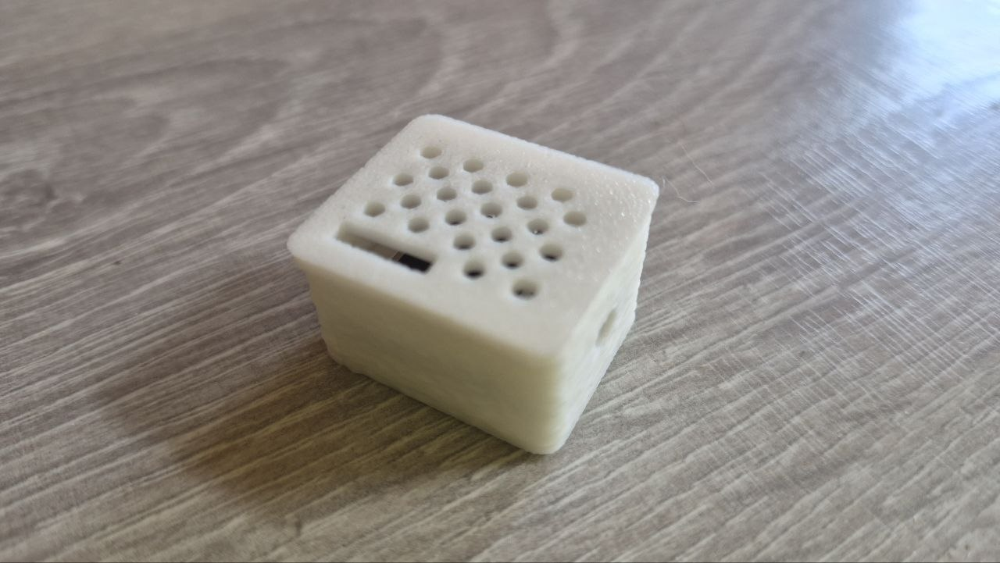

# RobotX UART Wi-Fi Robot

Готовый репозиторий для учебного робота RobotX с двумя режимами управления:

1. **Отладка с компьютера по USB/UART** — Python-пульт отправляет команды прямо в Arduino Nano.
2. **Работа через Wi-Fi модуль ESP32-C3** — телефон/планшет открывает веб-пульт, ESP32 пересылает команды в Arduino Nano по UART.



## Быстрый старт

### Вариант 1. Отладка с компьютера без ESP32

1. Прошейте Arduino Nano скетчем из папки `arduino/RobotX_Nano_UART_Control/`.
2. Установите Python-зависимость:

```bash
pip install -r pc_control/requirements.txt
```

3. Запустите пульт:

```bash
python pc_control/robotx_uart_control.py
```

4. Выберите COM-порт Arduino Nano, скорость `9600`, нажмите **Подключиться**.



### Вариант 2. Управление через ESP32-C3 Wi-Fi

1. Прошейте ESP32-C3 скетчем из папки `esp32_wifi/RobotX_ESP32C3_WiFi_Joystick/`.
2. В Arduino IDE для ESP32-C3 включите: `Tools -> USB CDC On Boot -> Enabled`.
3. Подключите ESP32-C3 к Arduino Nano:



4. Подключитесь телефоном к Wi-Fi сети ESP32.
5. Откройте в браузере адрес `http://192.168.4.1`.



## Структура репозитория

```text
RobotX_UART_WiFi_Robot/
├── README.md
├── arduino/
│   ├── RobotX_Nano_UART_Control/
│   │   └── RobotX_Nano_UART_Control.ino
│   └── libraries/
│       └── ServoTimer2-master.zip
├── esp32_wifi/
│   └── RobotX_ESP32C3_WiFi_Joystick/
│       └── RobotX_ESP32C3_WiFi_Joystick.ino
├── pc_control/
│   ├── robotx_uart_control.py
│   └── requirements.txt
├── docs/
│   ├── arduino_project.md
│   ├── wifi_module.md
│   ├── uart_protocol.md
│   └── debug_pc_control.md
├── configs/
│   └── atom_network_presets.txt
├── stl/
│   └── *.stl
└── images/
```


## STL детали для 3D-печати

В папке `stl/` лежат детали для печати:

1. корпус для ESP32-C3;
2. держатели сервоприводов;
3. переходные детали для конструктора «Знаток».

## UART-протокол

Все управляющие команды — это один ASCII-символ и перевод строки `
`.

| Команда | Назначение |
|---|---|
| `F` | ехать вперёд |
| `B` | ехать назад |
| `L` | поворот влево |
| `R` | поворот вправо |
| `S` | стоп моторов |
| `Q` / `q` | левая серва вверх / остановить движение левой сервы вверх |
| `A` / `a` | левая серва вниз / остановить движение левой сервы вниз |
| `W` / `w` | правая серва вверх / остановить движение правой сервы вверх |
| `D` / `d` | правая серва вниз / остановить движение правой сервы вниз |

Подробнее: [`docs/uart_protocol.md`](docs/uart_protocol.md)

## Фотографии проекта

### Внешний вид робота


### Используемые компоненты



### Wi-Fi модуль





## Важные замечания

- Для работы Python-пульта нужен пакет `pyserial`.
- Для Arduino Nano нужна библиотека `ServoTimer2`; архив библиотеки лежит в `arduino/libraries/`.
- В Arduino-скетче при работе через ESP32 лучше поставить `#define DEBUG_SERIAL 0`, чтобы отладочные сообщения не мешали UART-линии.
- На Arduino Nano пины `D0/RX` и `D1/TX` используются также для загрузки скетча. Если прошивка не загружается, временно отключите провод от ESP32 TX к Nano RX.
- В ESP32-C3 для USB Serial обычно нужно включить `USB CDC On Boot: Enabled`.

## Документация

- [Arduino проект](docs/arduino_project.md)
- [Wi-Fi модуль ESP32-C3](docs/wifi_module.md)
- [UART-протокол](docs/uart_protocol.md)
- [Python-пульт для отладки](docs/debug_pc_control.md)
