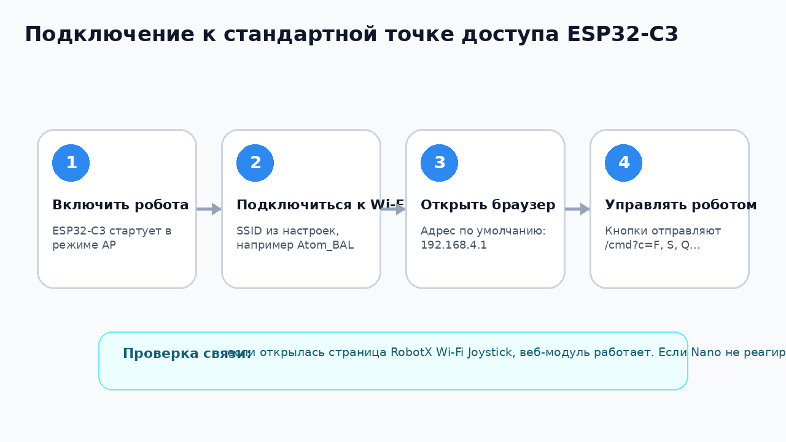

# Wi-Fi модуль ESP32-C3

Файл скетча: `esp32_wifi/RobotX_ESP32C3_WiFi_Joystick/RobotX_ESP32C3_WiFi_Joystick.ino`


## Назначение

ESP32-C3 работает как мост:

```text
Телефон / планшет / компьютер
        ↓ Wi-Fi + HTTP
ESP32-C3 WebServer
        ↓ UART Serial1, 9600 бод
Arduino Nano
        ↓
моторы и сервоприводы
```

ESP32 не управляет моторами напрямую. Он только показывает веб-страницу и пересылает команды в Arduino Nano.

## Подключение к Arduino Nano


| ESP32-C3 | Arduino Nano | Назначение |
|---|---|---|
| `GPIO4 / TX` | `D0 / RX` | команды от ESP32 к Nano |
| `GPIO5 / RX` | `D1 / TX` | необязательно, обратный канал пока не используется |
| `GND` | `GND` | общая земля, обязательно |

В коде ESP32:

```cpp
const int UART_TX_PIN = 4;
const int UART_RX_PIN = 5;
const int UART_BAUD   = 9600;
```

## Подключение по стандартной точке доступа



1. Включить робота.
2. Подключиться телефоном к Wi-Fi сети ESP32.
3. Открыть браузер.
4. Перейти на адрес:

```text
http://192.168.4.1
```

Откроется пульт:


## Веб-адреса

### Главная страница

```text
/
```

Открывает HTML-пульт управления.

### Отправка команды

```text
/cmd?c=F
```

Параметр `c` — команда. Примеры:

```text
/cmd?c=F  вперёд
/cmd?c=S  стоп
/cmd?c=Q  левая серва вверх
/cmd?c=q  остановить движение левой сервы вверх
```

### Информация о модуле

```text
/info
```

Возвращает текстовую информацию:

- режим Wi-Fi;
- имя AP;
- STA SSID;
- текущий IP;
- UART TX/RX;
- скорость UART.

## USB Serial для настройки

Настройка ESP32 выполняется через USB Serial на скорости `115200` бод.

Для ESP32-C3 в Arduino IDE обычно нужно включить:

```text
Tools -> USB CDC On Boot -> Enabled
```

После прошивки откройте Serial Monitor:

```text
115200 baud
Newline или Both NL & CR
```

## Команды настройки

### HELP

```text
HELP
```

Печатает список доступных команд.

### INFO

```text
INFO
```

Показывает текущие настройки:

- режим `AP` или `STA`;
- AP SSID и пароль;
- STA SSID и пароль;
- статический IP включён или нет;
- текущий IP.

### SETMODE AP

```text
SETMODE AP
```

Сохраняет режим точки доступа. После команды нужно выполнить:

```text
REBOOT
```

### SETMODE STA

```text
SETMODE STA
```

Сохраняет режим подключения к существующей Wi-Fi сети. После команды нужно задать сеть командой `SETSTA`, а затем выполнить `REBOOT`.

### SETAP

```text
SETAP Atom_BAL 55551111
```

Задаёт имя и пароль точки доступа ESP32.

Формат:

```text
SETAP <SSID> <PASSWORD>
```

Требования:

- пароль AP должен быть не короче 8 символов;
- SSID и пароль лучше писать без пробелов.

### SETSTA

```text
SETSTA MyWiFi mypassword
```

Задаёт сеть, к которой ESP32 будет подключаться в режиме `STA`.

Формат:

```text
SETSTA <SSID> <PASSWORD>
```

### SETDHCP

```text
SETDHCP
```

Отключает статический IP. В режиме `STA` адрес будет выдаваться роутером.

### SETSTATIC

```text
SETSTATIC 192.168.1.77 192.168.1.1 255.255.255.0 8.8.8.8
```

Формат:

```text
SETSTATIC <IP> <GATEWAY> <SUBNET> <DNS>
```

В репозиторной версии скетча статический IP не только сохраняется в NVS, но и применяется перед `WiFi.begin()` через `WiFi.config(...)`.

### REBOOT

```text
REBOOT
```

Перезагружает ESP32. Нужен после изменения режима или Wi-Fi настроек.

## Пример настройки точки доступа

```text
SETAP Atom_BAL 55551111
SETMODE AP
REBOOT
```

После перезагрузки подключиться к сети `Atom_BAL` с паролем `55551111` и открыть:

```text
http://192.168.4.1
```

## Пример настройки подключения к роутеру

```text
SETSTA MyWiFi mypassword
SETMODE STA
SETDHCP
REBOOT
```

После перезагрузки ESP32 подключится к роутеру. Текущий IP можно посмотреть командой `INFO` через USB Serial или в интерфейсе роутера.

## Что проверено в коде

- Веб-страница отправляет `/cmd?c=...`.
- Обработчик `/cmd` вызывает `sendToNano(cmd)`.
- `sendToNano()` отправляет команду в `Serial1` и добавляет `
`.
- `Serial1` настроен как `9600, SERIAL_8N1, RX=GPIO5, TX=GPIO4`.
- Настройки Wi-Fi сохраняются в `Preferences` / NVS.
- Для режима `STA` добавлено применение статического IP через `WiFi.config(...)`.
